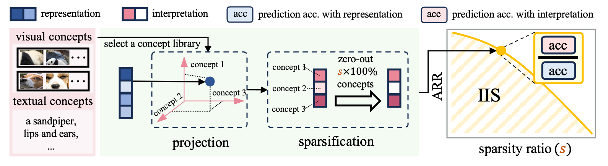

# [ICLR 2025 Spotlight] Enhancing Pre-trained Representation Classifiability can Boost its Interpretability

**This is the official implementation of our paper:** [Enhancing Pre-trained Representation Classifiability can Boost its Interpretability](https://openreview.net/pdf?id=GjfIZan5jN).

## Overview

We propose a general framework to transform vision representations to different types of concepts for interpretable image classification and present a quantification called **Inherent Interpretability Score (IIS) **for vision representation interpretability.



If you find this repository or our paper useful, please consider citing and staring us!

```tex
@inproceedings{shenenhancing,
  title={Enhancing Pre-trained Representation Classifiability can Boost its Interpretability},
  author={Shen, Shufan and Qi, Zhaobo and Sun, Junshu and Huang, Qingming and Tian, Qi and Wang, Shuhui},
  booktitle={The Thirteenth International Conference on Learning Representations},
  year={2025}
}
```

## Getting Started:

### Installation:

- Clone this repo:

  ```
  git clone https://github.com/ssfgunner/IIS.git
  cd IIS
  ```

- Create a conda virtual environment and activate it:

  ```
  conda create -n iis python=3.8 -y
  conda activate iis
  ```

- Install dependencies:

  ```
  pip install -r requirements.txt
  ```

### Dataset Preparation:

All datasets are put in  `./datasets` for default. Users can also modify the DATASET_ROOTS in `data_utils.py`:

```python
# Taking ImageNet-1K for example:
DATASET_ROOTS = {
    "imagenet_train": "./datasets/imagenet/train",
    "imagenet_val": "./datasets/imagenet/val",
}
```

The file structure should look like:

```bash
datasets
├── imagenet
│   ├── train
│   └── val
├── cub
│   ├── train
│   └── val
└── ...
```

## Interpretable Image Classifications:

We transform the vision representations to concepts for interpretable predictions. Taking the ImageNet-1K for example:

### Quick Start:

For ease of running, we provide the following pipelines for Text concepts:

```bash
bash concept_extract.sh
bash emb_extractor.sh
bash ip_train.sh
```

### [Optional] Run in stages:

#### Concept Acquisition:

Taking the *Prototype* and *Text* concepts for example.

For *Prototype* concepts, we first extract patches or segments from images:

```bash
# Taking the validation set for concept extraction:
cd ./concept_extractor
path_of_concept_dataset="../datasets/imagenet/val"
# extract image segments
python segment_extractor.py --data_root ${path_of_concept_dataset} --save_root ../concept_library/prototype/segments
# or extract image patches
python patch_extractor.py --data_root ${path_of_concept_dataset} --save_root ../concept_library/prototype/patches
```

The *Text* concepts are listed words stored in a txt file. We utilize the concept library from [LF-CBM](https://openreview.net/pdf?id=GjfIZan5jN) for example. Users can define textual concepts in accordance with their specific requirements and tailored datasets. 

#### Concept Vector Extraction:

Then, we obtain vectors corresponding to the acquired concepts within the representation space. 

Taking the representation space the penultimate layer of pre-trained [ResNet-50](https://openreview.net/pdf?id=GjfIZan5jN) for example:

```bash
cd ./concept_extractor
# for Prototype concepts
config_yaml='../model_configs/resnet50_IMAGENET1K_V1.yaml'
model='resnet50'
target_layer_name='layer4'
weights='IMAGENET1K_V1'
target_dataset='imagenet'
prototype_concept_path='../concept_library/prototype/segments'
python visual_element_emb_extractor.py --config_yaml ${config_yaml} --model ${model} --target_layer_name ${target_layer_name} --weights ${weights} --data-path ${prototype_concept_path}

# for Text concepts
text_concept_path='../concept_library/textual/imagenet_filtered.txt'
python textual_emb_extractor.py --dataset ${target_dataset} --concept_set ${text_concept_path} --backbone ${model} --activation_dir ./embs/${model}/ --feature_layer ${target_layer_name}
```

#### Interpretable Predictions based on Concepts:

With the concept vectors, we train the classification head with different sparsity ratios for interpretable predictions.

```bash
cd ./IP_training
model_name='resnet50'
target_dataset='imagenet'
target_layer_name='layer4'

# Prototype:
python IP_Prototype_training.py --model_name ${model_name} --in_channels 2048 --concept_path ../concept_extractor/embs/${model_name}/visual_element_emb.pkl \
    --num_concepts 200 --num_classes 1000 --n_epoch 30 --train_pt ../concept_extractor/embs/${model_name}/${target_dataset}_train_${model_name}_${target_layer_name}.pt --val_pt ../concept_extractor/embs/${model_name}/${target_dataset}_val_${model_name}_${target_layer_name}.pt \
    --save_dir ./IP_Prototype/${model_name}

# Textual:
python IP_Text_training.py --dataset ${target_dataset} --backbone ${model_name} --concept_set '../concept_library/textual/${target_dataset}_filtered.txt' --feature_layer ${target_layer_name} --sparsity_ratio --save_dir ./output --activation_dir '../concept_extractor/embs/${model_name}'
```

## IIS Computing:

After training classification head based on interpretations with different sparsity ratios, we can compute the IIS score to evaluate the interpretability of pre-trained representations.

```bash
python iis_computing.py
```

## Acknowledgements:

Our code is modified from [CLIP]() and [LF-CBM](). We thank the authors for their open-sourced code.
